# 🎓 EduFlow — Modern E-Learning Platform (Frontend)

A sleek, responsive, enterprise-grade E-Learning frontend built with **React 19**, **TypeScript**, **Vite**, and **Tailwind CSS**. Features distinct portals for **Students**, **Instructors**, and **Administrators** with real-time progress tracking, interactive quizzes, video learning, and certificate generation.

```text
E-Learning Platform Frontend
        ↓
React 19 • TypeScript • Vite
        ↓
Student Portal • Instructor Portal • Admin Portal
        ↓
Spring Boot REST API
```

---

## 📸 Screenshots & Visual Tour

### 1. Public Marketplace & Course Discovery
| Landing Page | Course Marketplace |
| :---: | :---: |
|  | 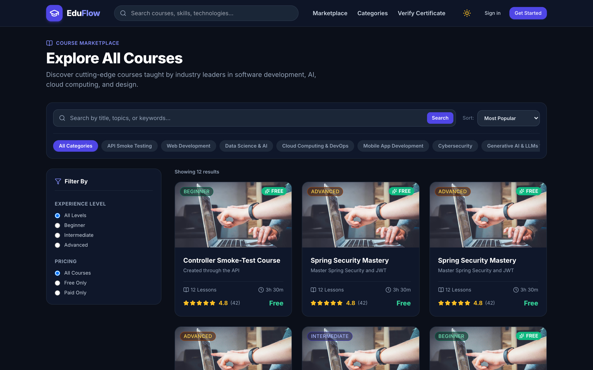 |

| Course Syllabus & Overview |
| :---: |
| 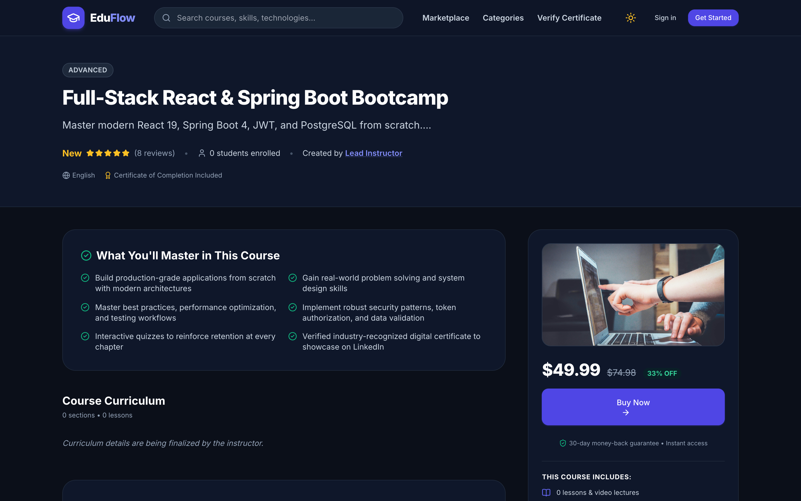 |

---

### 2. Student Experience & Learning
| Student Learning Portal | Immersive Classroom Player |
| :---: | :---: |
| 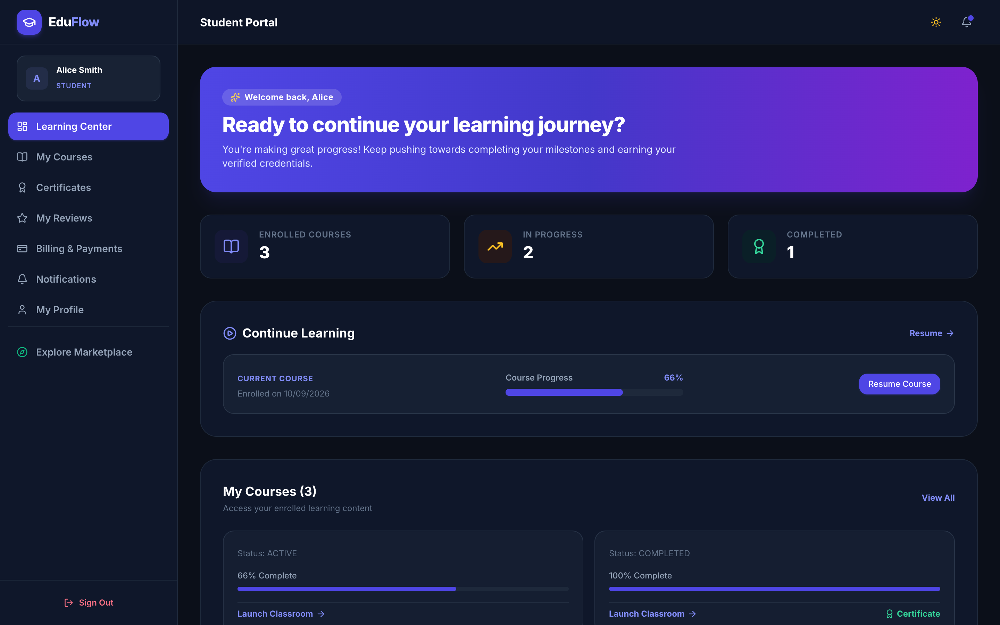 | 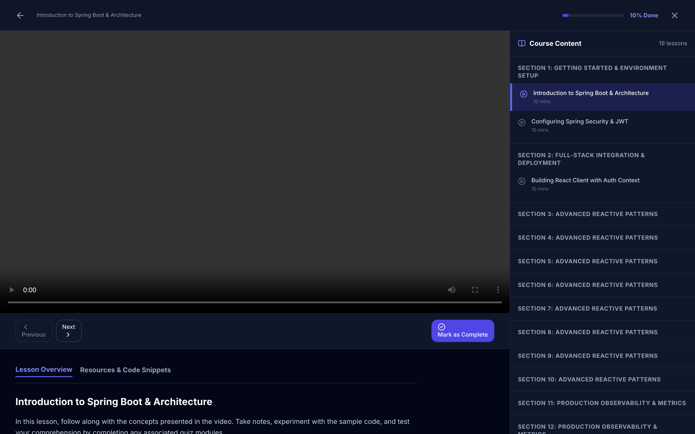 |

| Assessment & Knowledge Checks | Verified Credential Certificate |
| :---: | :---: |
| 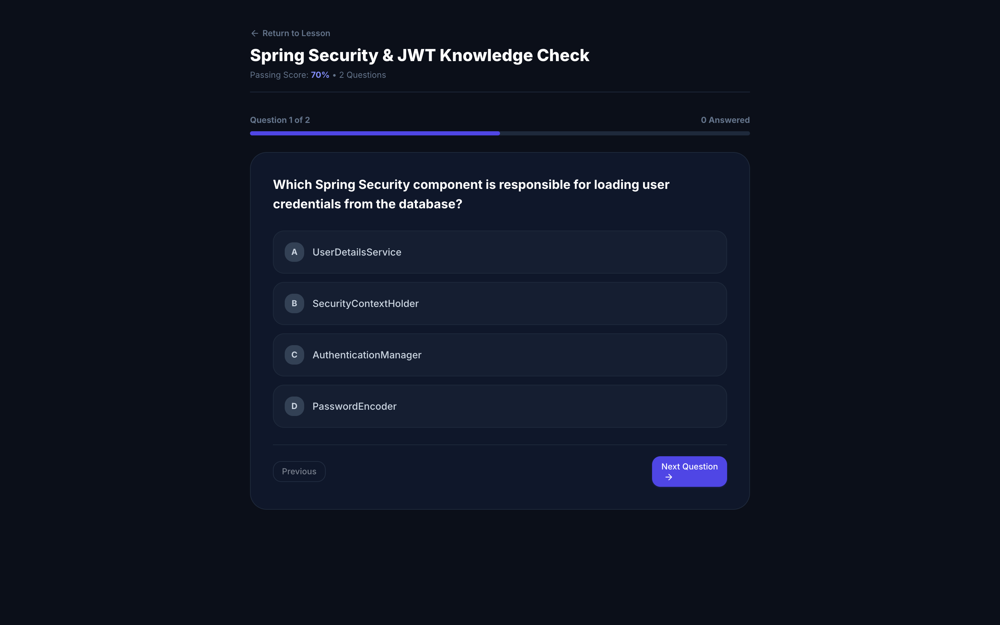 |  |

---

### 3. Instructor Creator Studio
| Creator Analytics Dashboard | Curriculum & Course Editor |
| :---: | :---: |
| 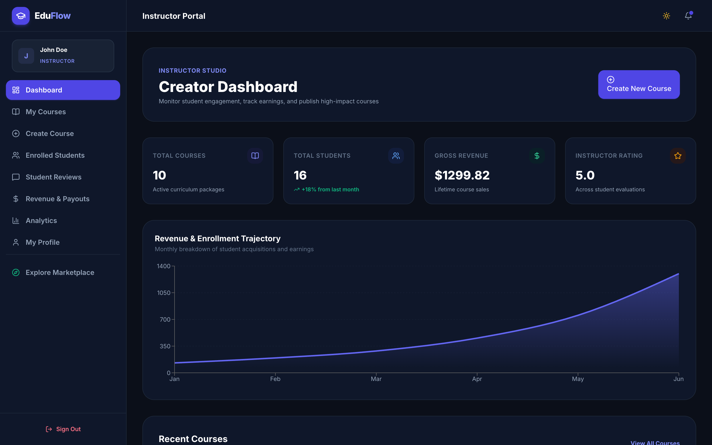 | 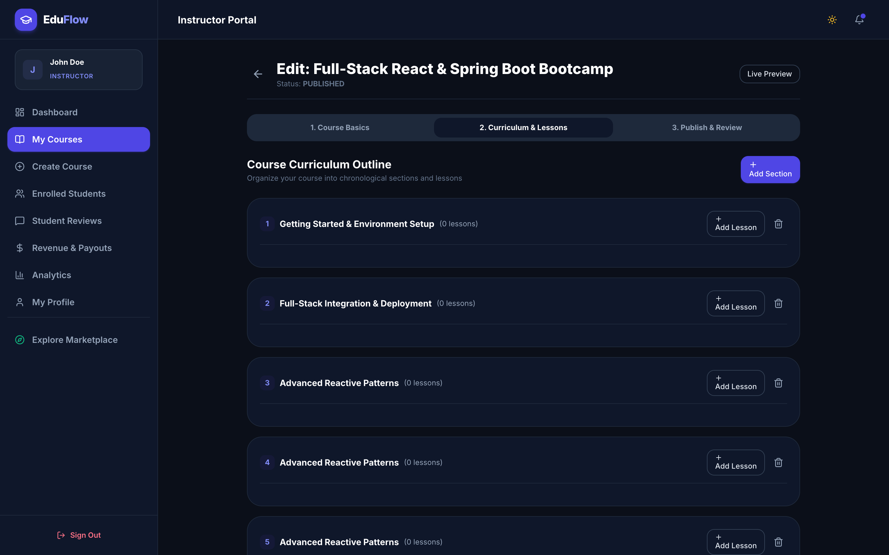 |

| Assessment & Quiz Builder | Revenue & Engagement Analytics |
| :---: | :---: |
| 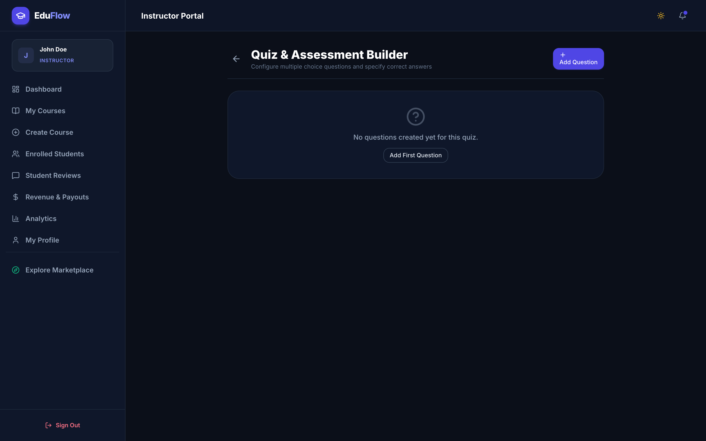 | 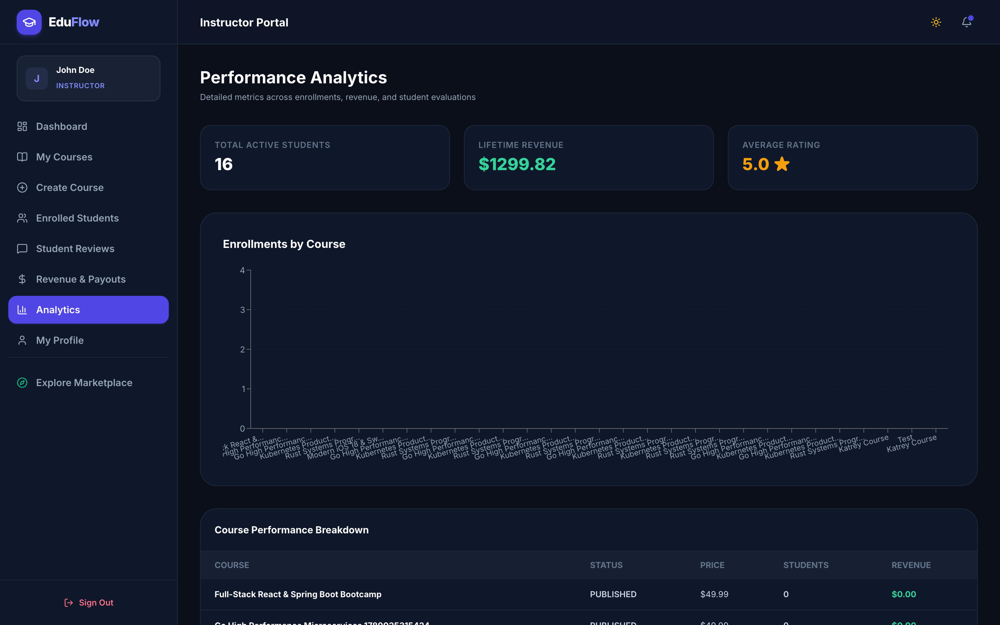 |

---

### 4. Platform Administration & Governance
| Platform Command Center | Course Moderation Queue |
| :---: | :---: |
| 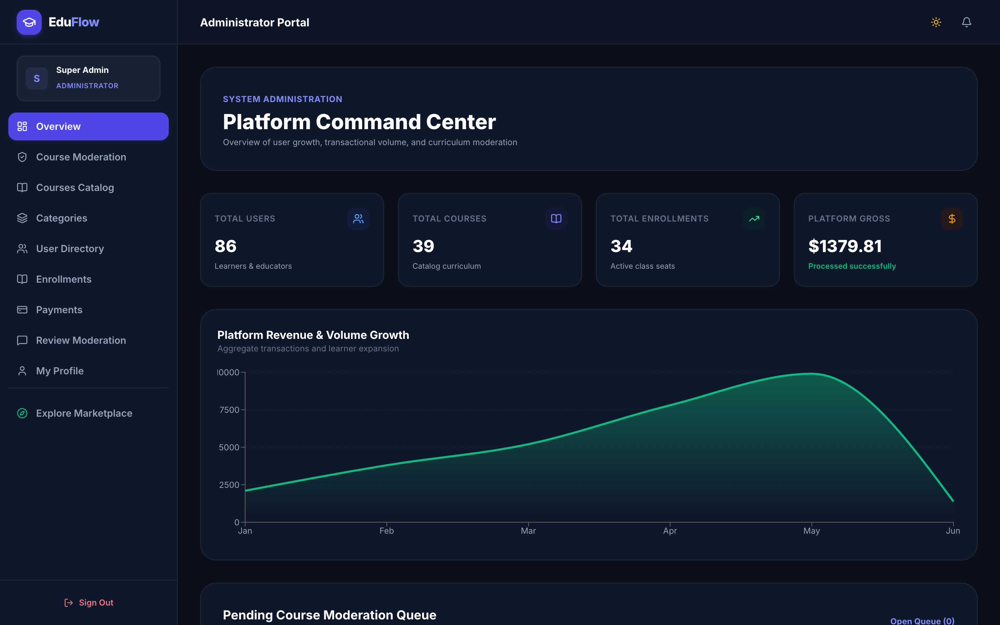 | 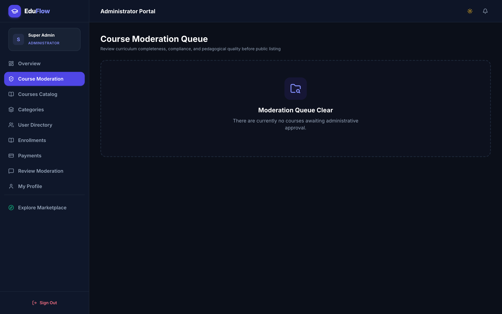 |

| User Directory & Role Control |
| :---: |
| 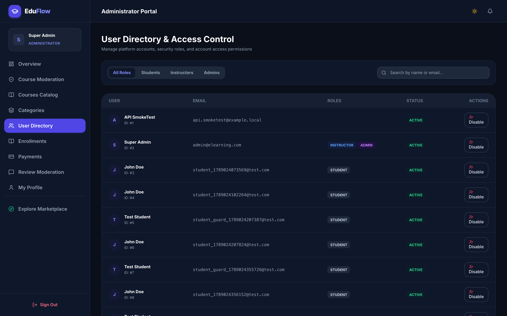 |

---

## 🛠️ Technology Stack

- **Core**: React 19, TypeScript, Vite
- **Styling**: Tailwind CSS (Dark Mode tailored palette), Glassmorphic accents
- **Icons**: Lucide React
- **HTTP Client**: Axios with JWT Interceptors & Auto-refresh
- **Routing**: React Router DOM (Role-Based Protected Routes)

---

## 🚀 Getting Started

### Prerequisites
- Node.js (v18+)
- Backend API running on `http://localhost:8081`

### Installation
```bash
# Clone the repository
git clone https://github.com/azharmoon007-hue/elearning-frontend.git
cd elearning-frontend

# Install dependencies
npm install

# Start development server
npm run dev
```

Application will be accessible at: `http://localhost:5173`

---

## 🔑 Demo Credentials

| Role | Email | Password |
|---|---|---|
| **Admin** | `admin@elearning.com` | `Admin@123` |
| **Instructor** | `john.doe@elearning.com` | `Instructor@123` |
| **Student** | `alice.smith@student.com` | `Student@123` |
